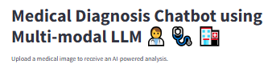

# Medical Diagnosis Chatbot using Multi-Modal LLM 👨‍⚕️ 🩺 🏥
---

## Overview

The **Medical Diagnosis Chatbot** is an advanced AI-powered application designed to analyze medical images (like X-rays or scans) and generate detailed diagnostic reports. It uses **Google GEMINI** and **GROQ AI** models for high-quality analysis and simplified explanations in layman's terms. The application ensures precision in its analysis and guides users with actionable insights while including disclaimers for professional consultations.

---

  
*A cutting-edge medical chatbot leveraging GEMINI and GROQ AI for medical image analysis and simplified explanations.*

---

## Table of Contents
- [Overview](#overview)
- [Features](#features)
- [Installation](#installation)
- [How to Use](#how-to-use)
- [Application Flow](#application-flow)
- [Technologies Used](#technologies-used)
- [Screenshots](#screenshots)
- [License](#license)


---
## Problem Statement

In the healthcare industry, accurate and timely medical diagnosis is crucial to ensure effective treatment and patient outcomes. However, the process of diagnosing medical conditions from images, such as X-rays, MRIs, or CT scans, can be complex, time-consuming, and requires expert medical knowledge. Many healthcare facilities, especially in remote or resource-limited settings, may not have immediate access to specialists for image analysis, leading to delays in diagnosis and treatment.

Furthermore, the information in medical reports often uses complex medical terminology that can be difficult for non-medical individuals, including patients, to understand. This creates a gap between medical professionals and patients, making it harder for patients to comprehend their health conditions fully.

### Key Challenges:
1. **Accuracy in Medical Diagnosis**: Analyzing medical images for various conditions requires a high level of expertise. Mistakes or delays in diagnosis can have severe consequences for patient health.
  
2. **Lack of Immediate Access to Experts**: Many hospitals and clinics, especially in underserved regions, struggle with a shortage of medical professionals capable of interpreting medical images quickly.

3. **Complex Terminology in Medical Reports**: Medical reports often contain technical jargon that patients or non-specialists may find difficult to understand, leading to confusion and miscommunication about health conditions.

4. **Time Sensitivity**: Early detection and accurate diagnosis of medical conditions are essential for effective treatment. Delays in obtaining expert opinions or understanding medical reports could lead to critical health risks.

### Objective

The **Medical Diagnosis Chatbot** was developed to address these challenges by providing a **AI-powered solution** for:
- **Automated medical image analysis** using advanced machine learning models, such as **Google GEMINI** and **GROQ AI**.
- **Simplified explanations** of medical reports to make them more accessible to patients and non-experts.
  
### Solution

The chatbot performs two main functions:
1. **Medical Image Analysis**: When a user uploads a medical image (e.g., an X-ray or CT scan), the application leverages **Google GEMINI AI** to analyze the image and generate a detailed diagnostic report, highlighting potential abnormalities, conditions, or health-related issues.
  
2. **Simplified Explanation**: Once the diagnostic report is generated, the user can opt for an "Explain Like I'm 5" mode, powered by **GROQ AI**, to receive a simplified version of the medical report. This makes complex medical information easier to understand for non-medical individuals, including patients or their families.

By combining these functionalities, the **Medical Diagnosis Chatbot** aims to:
- Enhance access to immediate medical insights for people who might not have ready access to expert medical professionals.
- Provide an intuitive interface for both medical experts and lay users, allowing them to easily interpret complex medical images and reports.
- Improve patient understanding and engagement by offering simplified, easy-to-understand explanations of medical diagnoses.

This project seeks to bridge the gap in healthcare by delivering efficient, accurate, and understandable medical image analysis and reports. It helps healthcare professionals provide faster and more effective treatment, especially in settings where expert knowledge may be scarce.

---


## Features

- **Image Upload**: Upload medical images in formats like `.jpg`, `.jpeg`, or `.png`.
- **Detailed Analysis**: Generate a structured diagnostic report using GEMINI AI.
- **Explain Like I'm 5 (ELI5)**: Simplify complex medical information for easier understanding with GROQ LLM.
- **User-Friendly Interface**: Clean and intuitive design built with Streamlit.
- **Safety and Guidance**: Includes a disclaimer to consult a medical professional.

---

## Installation

### Prerequisites
- Python 3.8 or above
- A Google GEMINI API key
- A GROQ API key
- Virtual Environment (recommended)

### Steps
1. Clone the repository:
   ```bash
   git clone https://github.com/your-repository/medical-diagnosis-chatbot.git
   cd medical-diagnosis-chatbot

2. **Create and activate a virtual environment**:
   ```bash
   python -m venv venv
   source venv/bin/activate  # On Windows: venv\Scripts\activate
   

3. **Install dependencies**:
    ```bash
    pip install -r requirements.txt

4. **Create a .env file in the root directory and add the following**:
    ```bash
    GROQ_API_KEY=your_groq_api_key
    GOOGLE_API_KEY=your_google_api_key

5. **Run the application**:
    ```bash
    streamlit run Medical_Diagnosis.py


## How to Use

1.  **Upload Image**: Click "Upload a Medical Image" and select a `.jpg`, `.jpeg`, or `.png` file.
2.  **Analyze Image**: Press the "Analyze Image" button to generate a detailed medical report.
3.  **Simplify Analysis**: If the report is too complex, click "Explain Like I'm 5 (ELI5)" to get a simplified version.

---

## Application Flow

1.  **Upload Image**: The user uploads an image, which is converted into a format suitable for analysis by the GEMINI AI model.
2.  **Medical Analysis**: The uploaded image is processed, and a detailed diagnostic report is generated based on predefined prompts.
3.  **Simplified Explanation**: Using the GROQ AI model, the report can be simplified into layman's terms for easier understanding.
4.  **User Interaction**: The user can view the original analysis, the simplified version, or upload a new image for further analysis.

---

## Technologies Used

*   **Streamlit**: For building the web application interface.
*   **Google GEMINI**: For generating detailed medical image analysis.
*   **GROQ AI**: For simplifying medical terminology using the Explain Like I'm 5 (ELI5) feature.
*   **Python**: Backend logic and API integration.

---

## Screenshots

### Application in Action

_Upload an image, analyze it, and simplify the results with ELI5._

### Detailed Analysis

_Generated detailed diagnostic report._

### Simplified Explanation (ELI5)

_Easily understandable explanations using GROQ AI._

---

## Images Used

*   **Title Banner**:
    

*   **GROQ Logo**:
    

*   **Google GEMINI Logo**:
    

---

## License

This project is licensed under the MIT License. See the LICENSE file for details.

---

## Contributing

Contributions are welcome! If you'd like to improve the application or fix any issues, feel free to fork the repository and submit a pull request.
